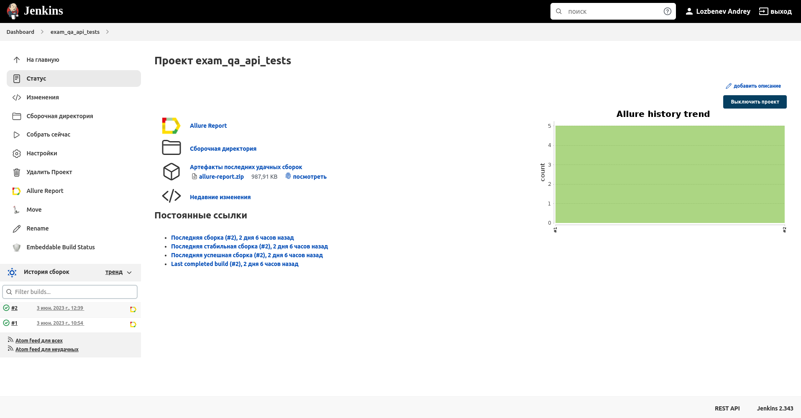
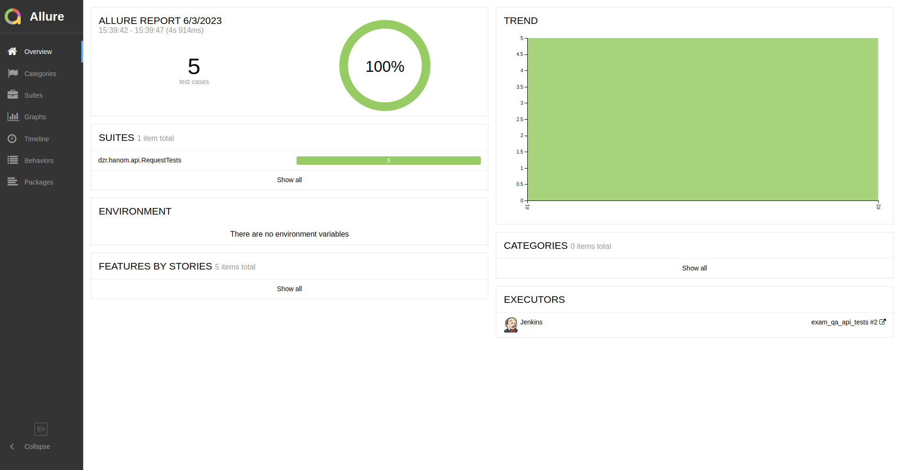
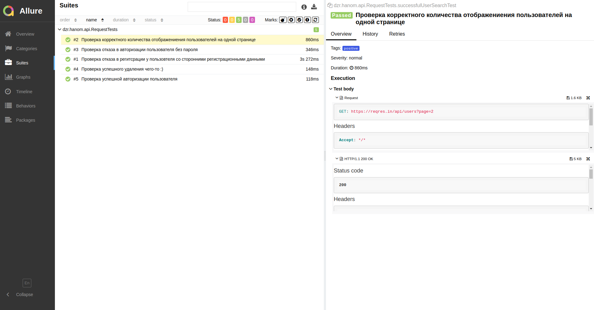
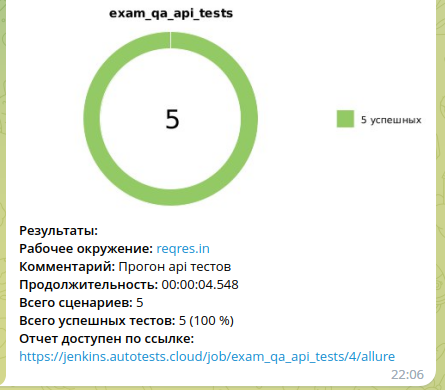
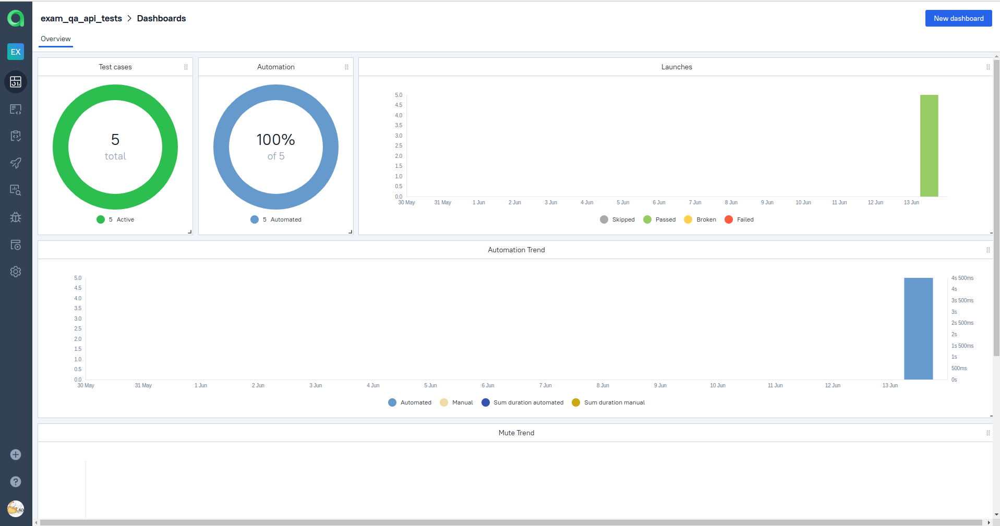
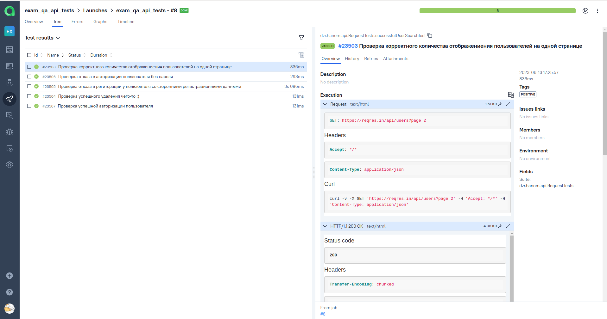
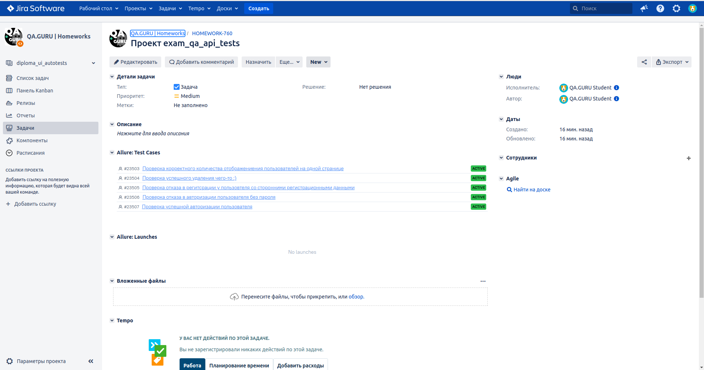

# Дипломный проект по тестированию API для [reqres.in](https://reqres.in/)

## :open_book: Содержание:
- [Технологии и инструменты](#gear-в-проекте-используются-следующие-технологии-и-инструменты)
- [Что проверяем](#heavy_check_mark-что-проверяем)
- [Запуск тестов из Jenkins](#-запуск-тестов-из-jenkins)
- [Запуск тестов из терминала](#computer-запуск-тестов-из-терминала)
- [Отчеты](#bar_chart-отчеты-о-прохождении-тестов-доступны-в-allure)
- - [Allure](#-allure)


## :gear: В проекте используются следующие технологии и инструменты:

<p align="center">


</p>

## :heavy_check_mark: Что проверяем

> - Проверка корректного количества отображениения пользователей на одной странице
> - Проверка отказа в авторизации пользователя без пароля
> - Проверка отказа в регитсрации у пользовтеля со сторонними регистрационными данными
> - Проверка успешного удаления чего-то :)
> - Проверка успешной авторизации пользователя
##  Запуск тестов из [Jenkins](https://jenkins.autotests.cloud/job/Students/job/exam_qa_api_tests/)

Для запуска тестов из Jenkins:
1. Необходимо нажать кнопку "Собрать".
   
2. Нажать кнопку "Собрать".

### :earth_asia: Удаленный запуск тестов

```bash
gradle clean test
```

## :computer: Запуск тестов из терминала

Для локального запуска необходимо выполнить команду:
```
gradle clean test
```

## :bar_chart: Отчеты о прохождении тестов доступны в Allure

###   [Allure](https://jenkins.autotests.cloud/job/exam_qa_api_tests/2/allure/)

#### Главная страница



#### Тесты



## <a id="telegram"></a> Отчёт в Telegram

После завершения сборки сообщение с основными результатами прогона тестов отправляется через созданный бот в выбранный телеграм-канал
<p align="center">


## </a> Интеграция с <a target="_blank" href="https://allure.autotests.cloud/project/3418/dashboards">Allure TestOps</a>

### Dashboard с  результатами тестирования
<p align="center">

</p>

### Пример отчёта выполнения одного из автотестов
<p align="center">

</p>

## </a> Интеграция с <a target="_blank" href="https://jira.autotests.cloud/browse/HOMEWORK-760">Atlassian Jira</a>
<p align="center">

</p>